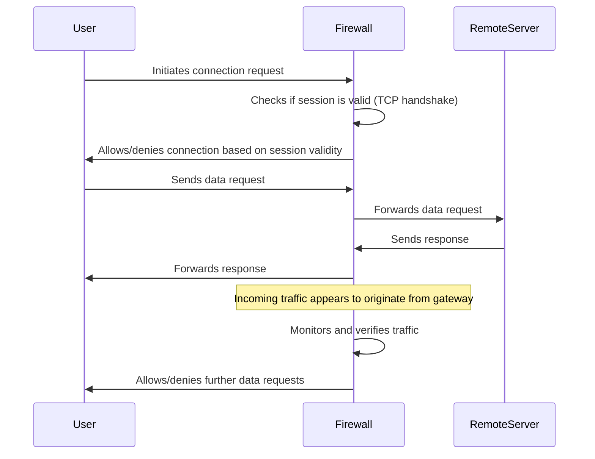

---
{"dg-publish":true,"permalink":"/circuit-level-gateway-firewall/"}
---

A **circuit-level gateway** firewall works at the **[[OSI Layer 5\|Session Layer]]** of the OSI model or the **[[OSI Layer 4\|Transport Layer]]** of TCP/IP.
- It forwards data between networks without verification and blocks incoming packets from the host but allows the traffic to pass through itself.
	- **Passes Data Between Networks Without Verification**: The circuit-level gateway allows the passage of data between an internal (trusted) network and an external (untrusted) network, such as the [[Internet\|Internet]]. However, it does not inspect the contents of the packets that are passing through it. Instead, ==it only ensures that the connection is valid at the session level==.
	- **Blocks Incoming Packets from the Host**: When an external device (like a server or client on the internet) sends packets to the internal network, ==the circuit-level gateway blocks these packets unless a valid session has been establishe==d. The gateway prevents any unsolicited or potentially harmful connections from the outside.
	- **Allows Traffic to Pass Through Itself**: Once a valid connection or session is established, the circuit-level gateway allows traffic to pass through, appearing to originate from the gateway itself, rather than the internal network. This helps maintain some level of anonymity and security for the internal network, as external devices only see the IP address of the gateway.
- Information passed to remote computers through a circuit-level gateway will appear to have originated from the gateway, as the incoming traffic carries the IP address of the proxy (circuit-level gateway).

**Such firewalls monitor requests to create sessions** and determine if those sessions will be allowed.
- A circuit-level gateway gives controlled access to network services and host requests.
- To determine whether a requested ==session is valid==, it checks the [[net/protocols/Transmission Control Protocol\|TCP/IP#3 Way Handshake]] between packets.
- Circuit proxy firewalls allow or prevent data streams; they do not filter individual packets.

- **Advantages**: Inexpensive, hides information about the private network, provides controlled access.
- **Disadvantages**: Does not inspect the content of the packets, limits control over the data flow.

## Example

the tester determines that there is a firewall between the tester’s machine and the target machine. The firewall is only monitoring TCP handshaking of packets at the session layer of the OSI model

