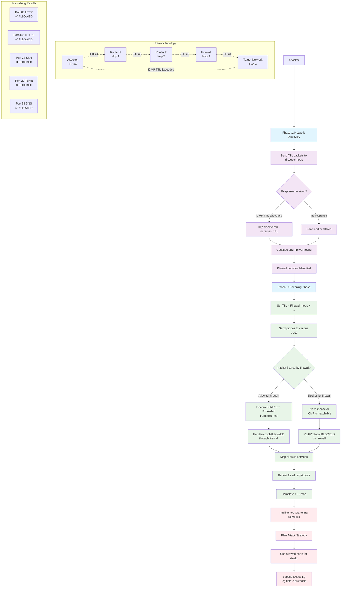

---
{"dg-publish":true,"permalink":"/firewalking/"}
---

Firewalking is a method of collecting information about remote networks behind firewalls.
- It is a technique that uses [[Time to Live\|TTL]] values to determine gateway ACL filters and map networks by analyzing the IP packet response.
- It probes ACLs on packet filtering routers/firewalls using the same method as tracerouting.
- Firewalking involves sending TCP or UDP packets into the firewall where the TTL value is one hop greater than the targeted firewall.
- If the packet makes it through the gateway, the system forwards it to the next hop, where the TTL equals one, and prompts an ICMP error message at the point of rejection with a "TTL exceeded in transit" message.
- This method helps locate a firewall; additional probing facilitates fingerprinting and identification of vulnerabilities.
- The detailed information obtained from firewalking can also assist attackers in crafting more precise and stealthy attack strategies, potentially aiding IDS evasion.
- Understanding firewall rules can help attackers avoid detection using allowed ports and protocols, thereby reducing the likelihood of triggering IDS alerts.
- Firewalk is a well-known application used for firewalking.
- It has two phases: a network discovery phase and a scanning phase.
- It comes with various open-source Linux distributions.
- [[net/sec/tools/nmap\|nmap]] has a firewalk script that can be used to perform firewalking.
- Firewalk and Nmap firewalk scripts provide critical insights into network configurations and firewall rules that can be leveraged to bypass security measures, including IDS, when combined with other evasion techniques.

