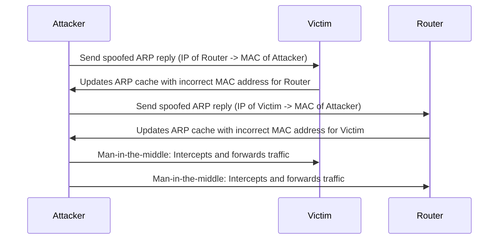
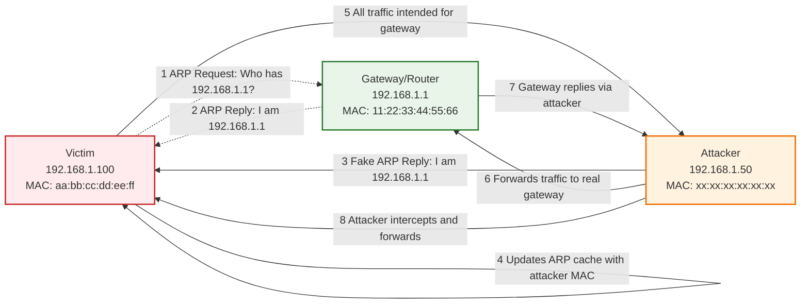

---
{"dg-publish":true,"permalink":"/hardware/laptop/arp-spoofing/"}
---

- [[Promiscuous Mode\|Promiscuous Mode]]

ARP poisoning involves **forging many ARP request** and reply packets to overload a [[Switch\|Switch]]
- ARP cache poisoning is the method of **attacking a LAN network** by updating the target computer's **ARP cache** with both forged ARP request and reply packets designed to change the [[OSI Layer 2\|Layer 2]] Ethernet MAC address (that of the network card) to one that the attacker can monitor
- Attackers use ARP poisoning to sniff on the target network
- Attackers can thus steal sensitive information, prevent network and web access, and perform [[Denial of Service\|DOS]] and [[Man in The Middle\|MiTM]] attacks

ARP resolves IP addresses to the MAC (hardware) address of the interface to send data. ARP packets can be forged to send data to the attacker’s machine. ARP spoofing involves constructing a large number of forged ARP request and reply packets to overload a switch. When a machine sends an ARP request, it assumes that the ARP reply will come from the right machine. ARP provides no means of verifying the authenticity of the responding device. Even systems that have not made an ARP request can accept the ARP replies coming from other devices. Attackers use this flaw in ARP to create malformed ARP replies containing spoofed IP and MAC addresses. Assuming it to be the legitimate ARP reply, the victim’s computer blindly accepts the ARP entry into its ARP table. Once the ARP table is flooded with spoofed ARP replies, the switch is set in forwarding mode, and the attacker intercepts all the data that flows from the victim’s machine without the victim being aware of the attack. Attackers flood a target computer’s ARP cache with forged entries, which is also known as poisoning. ARP spoofing is an intermediary for performing attacks such as DoS, MITM, and session hijacking. 

ARP spoofing is a method of attacking an Ethernet LAN. When a legitimate user initiates a session with another user in the same layer 2 broadcast domain, the switch broadcasts an ARP request using the recipient's IP address, while the sender waits for the recipient to respond with a MAC address. An attacker eavesdropping on this unprotected layer 2 broadcast domain can respond to the broadcast ARP request and replies to the sender by spoofing the intended recipient’s IP address. The attacker runs a sniffer and turns the machine’s NIC adapter to promiscuous mode.

## ARP Poisoning

The **result** of ARP spoofing, where the ARP cache is **poisoned** with incorrect IP-to-MAC mappings.

## Tools

- [[ettercap\|ettercap]]
- [[Cain and Abel\|Cain and Abel]]
