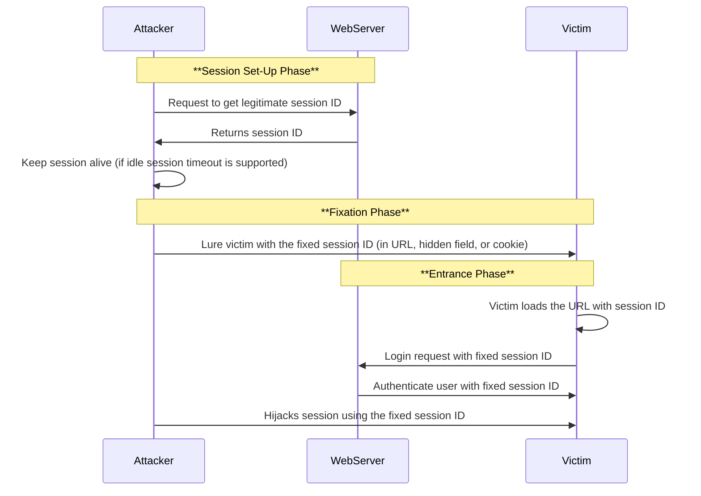

---
{"dg-publish":true,"permalink":"/session-fixation-attack/"}
---

**Web session security** prevents an attacker from intercepting, [[Brute force\|Brute forcing]], or predicting the **session ID** issued by a web server to a user’s browser as proof of an authenticated session
- However, this approach ignores the possibility of the attacker issuing a session ID to the user’s browser, forcing it to use the chosen session ID
- This type of attack is called a session fixation attack because an attacker fixes the user's session ID in advance, instead of generating it randomly at the time of login
- The attacker performs a session fixation attack to hijack a valid user session
- The attacker takes advantage of limitations in web-application session ID management
- Web applications allow the user to authenticate themselves using an existing session ID, instead of generating a new session ID
- In this type of attack, the attacker provides a legitimate web-application session ID and lures the victim to use it
- If the victim's browser uses that session ID, then the attacker can hijack the user-validated session because the attacker is already aware of the session ID used by the victim
- A session fixation attack is a kind of session hijack
- However, instead of stealing the session established between a user and web server after the user logs in, a session fixation attack fixes an established session on the user’s browser; thus, the attack is initiated before the user logs in
- An attacker uses various techniques to perform a session fixation attack: 
	- Session token in the URL argument 
	- Session token in a hidden form field 
	- Session ID in a cookie

The attacker must choose a technique based on how the target web application uses session tokens. The attacker exploits the vulnerability of a server that allows a user to use a fixed session ID. Then, the attacker provides a valid session ID to a victim and lures him to authenticate themselves using that session ID. A session fixation attack has the following three phases. 

- **Session set-up phase**: In this phase, the attacker first obtains a **legitimate session ID** by establishing a connection with the target web server. Few web servers support the idle session time-out feature. If the target web server supports this feature, the attacker needs to send requests repeatedly to keep the established trap session ID alive.

- **Fixation phase**: In this phase, the attacker introduces the **session ID to the victim's browser**, thereby fixing the session.
	
- **Entrance phase**: In this phase, the attacker waits for the victim to log in to the target web server using the trap session ID and then enters the victim’s session.

